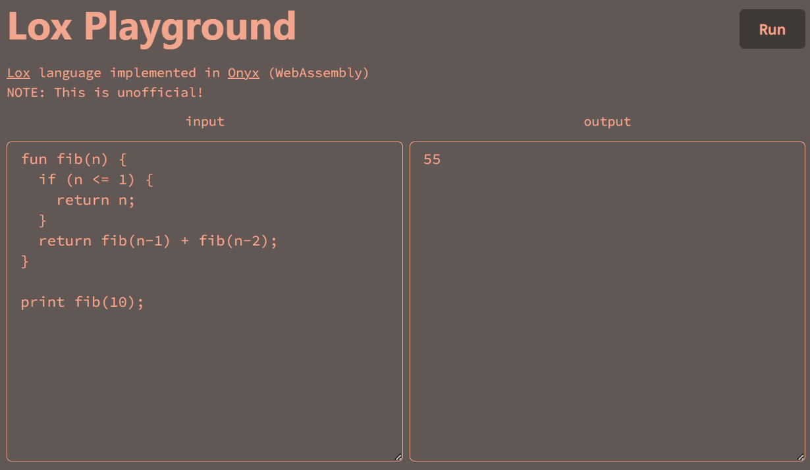

# onylox
[](https://github.com/Syuparn/onylox/actions/workflows/test.yml)
[](https://wasmer.io/syuparn/onylox)

[Lox language](https://github.com/munificent/craftinginterpreters) implemented in [Onyx](https://onyxlang.io/)

# Playground



# Run locally

```bash
$ make build
$ wasmer run --mapdir examples:examples onylox.wasm -- examples/hello.onyx
```

# Test

```bash
# bats is required
$ make test
```

# Dependencies

- Onyx v0.1.9
